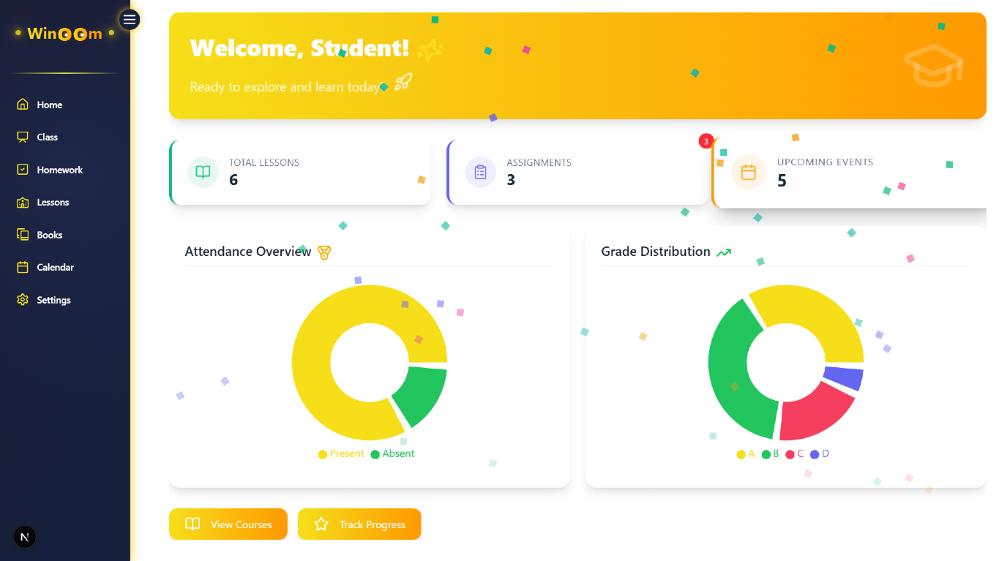
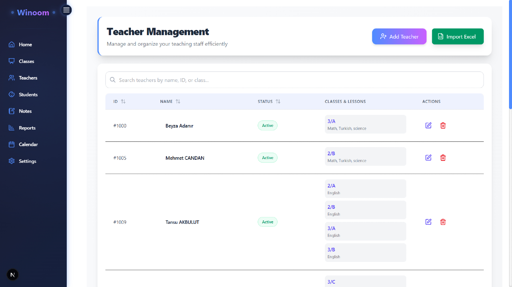
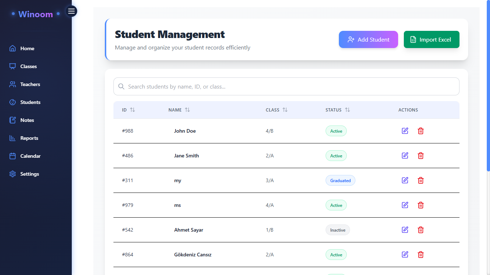
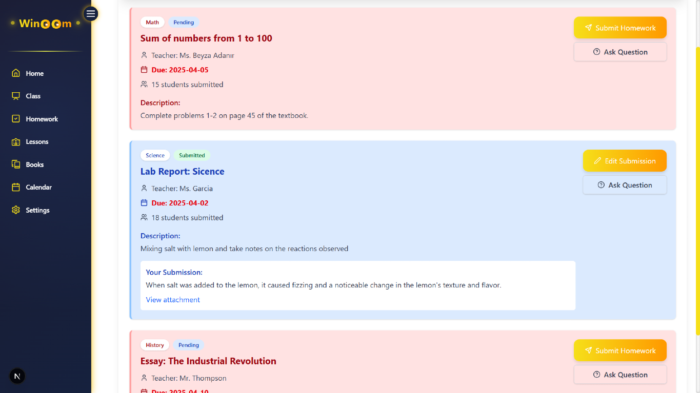
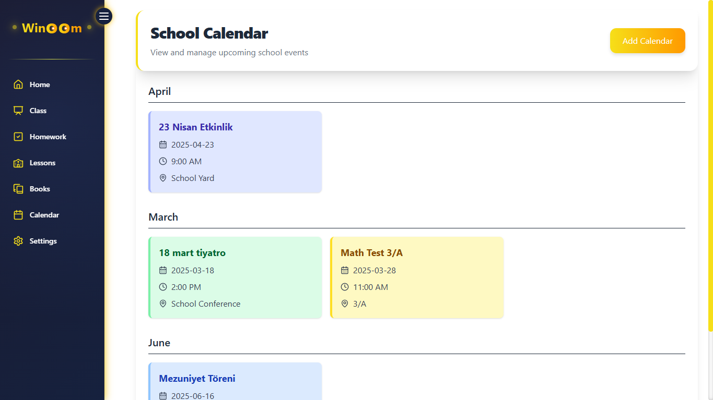

# 🎓 Winoom - Modern School Management System


## 🌟 Overview

Winoom is a comprehensive school management system built to revolutionize how educational institutions operate. Designed with specific interfaces for students, teachers, and academic advisors, Winoom creates a unified digital ecosystem for seamless educational management and communication.

## ✨ Key Features

### 👨‍🎓 For Students
- **📚 Class Management**: Access schedules, materials, and announcements instantly
- **📝 Homework Tracker**: Submit and track assignments with due date reminders
- **📖 Lesson Resources**: Interactive learning materials at your fingertips
- **📚 Digital Book Repository**: Access textbooks and reading materials online
- **📊 Attendance Dashboard**: Visual attendance statistics and records
- **📈 Grade Performance**: Track academic progress with intuitive charts

### 👩‍🏫 For Teachers
- **👨‍👩‍👧‍👦 Class Administration**: Efficiently manage multiple classes in one place
- **👥 Student Management**: Track individual student progress and engagement
- **📝 Note Taking**: Organized digital notes for classes and student feedback
- **📊 Reporting Tools**: Generate comprehensive academic performance reports
- **🧩 Teaching Resources**: Centralized repository for teaching materials
- **📈 Analytics Dashboard**: Visual insights into class and student performance

### 👨‍💼 For Academic Advisors
- **🧭 Program Overview**: Monitor effectiveness of educational programs
- **📊 Student Tracking**: Track academic journeys across multiple classes
- **📝 Enrollment Management**: Real-time enrollment statistics and forecasting
- **📈 Performance Analysis**: Identify trends and areas needing attention
- **⚖️ Resource Allocation**: Optimize educational resource distribution

## 🛠️ Technology Stack

### 🖥️ Frontend
- **🚀 Framework**: Next.js 15.2.2
- **⚛️ UI Library**: React 19.0.0
- **🎨 Styling**: TailwindCSS 4.1.3
- **📊 Data Visualization**: Recharts 2.15.2
- **🔣 Icons**: Lucide React 0.482.0
- **✨ Animation**: Framer Motion 12.6.3
- **🔄 HTTP Client**: Axios 1.8.4
- **🔔 Notifications**: React Hot Toast 2.5.2
- **📑 Spreadsheets**: xlsx 0.18.5

### ⚙️ Backend
- **🟢 Runtime**: Node.js
- **🛣️ Framework**: Express.js 4.21.2
- **🗄️ Database**: PostgreSQL (pg 8.14.1)
- **📚 API Documentation**: Swagger UI Express 5.0.1
- **🔄 Development**: Nodemon 3.1.9

## 🚀 Quick Start

### 📥 Installation

1. **Clone the repository:**
   ```
   git clone https://github.com/MYounesDev/Winoom.git
   cd Winoom
   ```

2. **One-click setup:**
   ```
   setup.bat
   ```
   
   This automatically installs all dependencies for both server and client.
   
   **Manual setup alternative:**
   ```
   cd Server
   npm install
   
   cd ../Client
   npm install
   ```

### ▶️ Running the Application

**Option 1: One-click start**
```
start.bat
```

**Option 2: Manual start**
```
# Terminal 1
cd Server
npm run dev

# Terminal 2
cd Client
npm run dev
```

🌐 Access the application at **http://localhost:3000/**

## 📖 API Documentation

Interactive API documentation automatically generated with Swagger:
```
http://localhost:5000/api-docs
```

## 🗄️ Database Configuration

Winoom uses PostgreSQL. Create a `.env` file in the Server directory:

```
DB_USER=postgres
DB_PASSWORD=your_password
DB_HOST=localhost
DB_PORT=5432
DB_DATABASE=winoom
```

## 👤 User Personas

### 👨‍🎓 Student
Students can manage their academic journey with instant access to classes, homework, resources, and performance metrics.

### 👩‍🏫 Teacher
Teachers get powerful tools to manage classes, track student progress, organize teaching materials, and generate comprehensive reports.

### 👨‍💼 Advisor
Academic advisors gain bird's-eye views of programs, student progress, enrollment trends, and resource allocation.

## 📸 Screenshots

| **👩‍🏫 Teacher Dashboard** | **👨‍🎓 Student Dashboard** |
|:---------------------:|:---------------------:|
|  |  |

| **👥 Teacher Management** | **👨‍👩‍👧‍👦 Student Management** |
|:----------------------:|:----------------------:|
|  |  |

| **📊 Attendance Tracking** | **📅 Calendar View** |
|:------------------------:|:-----------------:|
|  |  |

## 📁 Project Structure

### 🖥️ Client
```
Client/
├── src/
│   ├── app/             # Next.js app router components
│   ├── components/      # Reusable UI building blocks
│   ├── pages/           # Page components with routes
│   ├── services/        # API integration and data services
│   └── styles/          # Global and component styles
├── public/              # Static assets and resources
└── package.json         # Frontend dependencies
```

### ⚙️ Server
```
Server/
├── server.js            # Express API endpoints and business logic
└── package.json         # Backend dependencies and scripts
```


## 🤝 Contributing

Contributions are welcome! Please feel free to submit a Pull Request.

## 👏 Acknowledgements

- All the educational professionals who provided valuable insights
- Our beta testing schools and their dedicated staff
- The open-source community for the amazing tools and libraries


