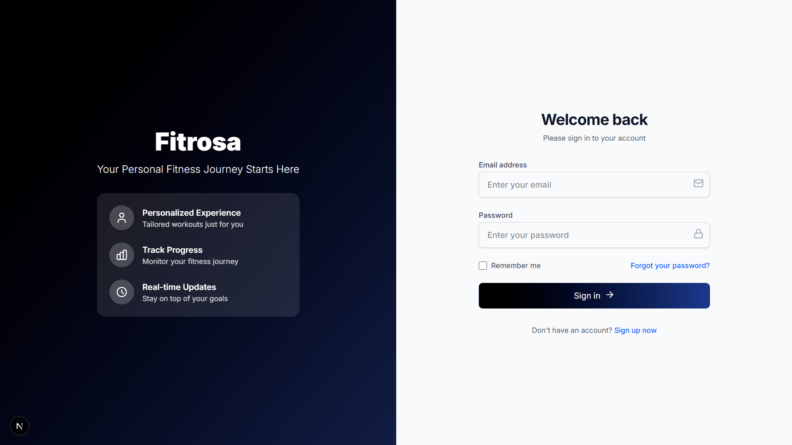
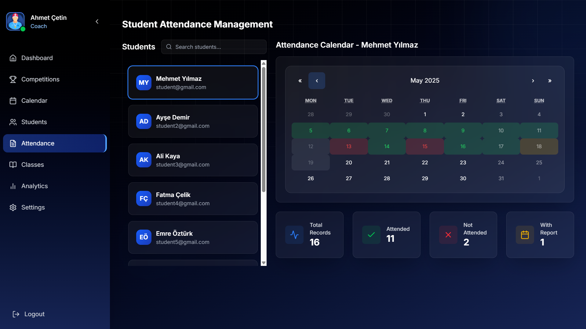
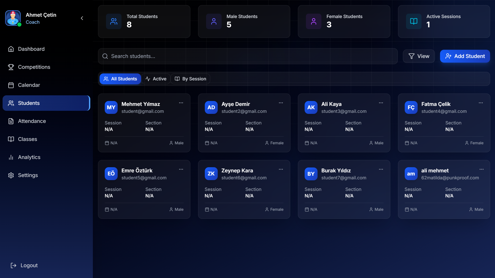
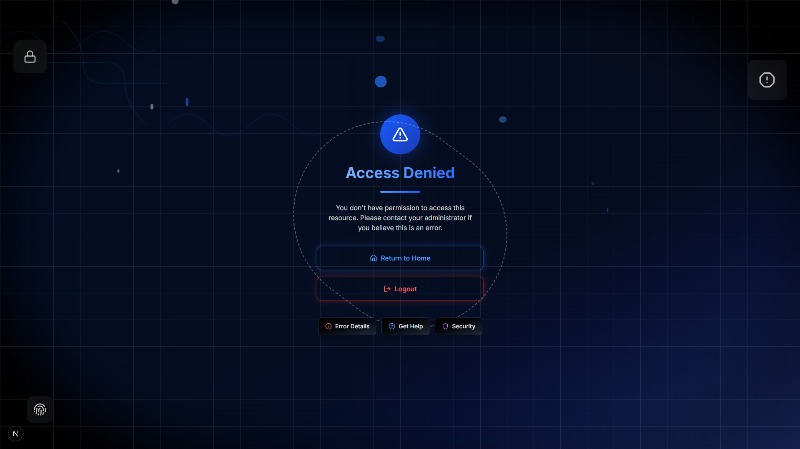

# Winoom - School Management System


## Overview

Winoom is a comprehensive school management system designed to support educational institutions by providing a unified platform for students, teachers, and academic advisors. The system streamlines communication, tracking, and administration of educational activities through role-specific interfaces.

## Features

### For Students
- **Class Management**: Access class schedules, materials, and announcements
- **Homework Tracking**: View, submit, and track assignments
- **Lesson Resources**: Access learning materials and lesson content
- **Book Repository**: Access digital textbooks and reading materials
- **Attendance Tracking**: Monitor attendance records with visual statistics
- **Grade Performance**: View grade distribution and performance metrics

### For Teachers
- **Class Administration**: Manage multiple classes and their schedules
- **Student Management**: Track student performance and participation
- **Note Taking**: Create and organize notes for classes and students
- **Reporting**: Generate and review academic performance reports
- **Teaching Resources**: Access and organize teaching materials
- **Student Performance Analytics**: Visual representation of student performance

### For Academic Advisors
- **Program Overview**: Monitor educational programs and their effectiveness
- **Student Progress Tracking**: Track student academic progress across classes
- **Enrollment Management**: Monitor student enrollment statistics
- **Performance Analysis**: Analyze performance trends across different metrics
- **Resource Allocation**: Manage educational resources efficiently

## Technology Stack

### Frontend
- **Framework**: Next.js 15.2.2
- **UI Library**: React 19.0.0
- **Styling**: TailwindCSS 4.1.3
- **Data Visualization**: Recharts 2.15.2
- **Icons**: Lucide React 0.482.0
- **Animation**: Framer Motion 12.6.3
- **HTTP Client**: Axios 1.8.4
- **Notifications**: React Hot Toast 2.5.2
- **Spreadsheet Management**: xlsx 0.18.5

### Backend
- **Runtime**: Node.js
- **Framework**: Express.js 4.21.2
- **Database**: PostgreSQL (pg 8.14.1)
- **Environment Variables**: dotenv 16.4.7
- **API Documentation**: Swagger UI Express 5.0.1, Swagger JSDoc 6.2.8
- **CORS Support**: cors 2.8.5
- **Development**: Nodemon 3.1.9

## Installation

1. Clone the repository:
   ```
   git clone https://github.com/MYounesDev/Winoom.git
   cd Winoom
   ```

2. Setup the project dependencies (using the included batch file):
   ```
   setup.bat
   ```
   
   Alternatively, install dependencies manually:
   
   For server:
   ```
   cd server
   npm install
   ```
   
   For client:
   ```
   cd client
   npm install
   ```

## Running the Application

Use the provided batch file to start both server and client:
```
start.bat
```

Or start them manually:

For server:
```
cd server
npm run dev
```

For client:
```
cd client
npm run dev
```

Access the application at http://localhost:3000/

## API Documentation

API documentation is automatically generated using Swagger and is available at:
```
http://localhost:5000/api-docs
```

## Database Setup

The application uses PostgreSQL for data persistence. Connection details should be specified in a .env file in the server directory with the following format:

```
DB_USER=postgres
DB_PASSWORD=your_password
DB_HOST=localhost
DB_PORT=5432
DB_DATABASE=winoom
```

## User Roles

### Student
Students can access their classes, view and submit homework, access lessons, and track their performance.

### Teacher
Teachers can manage classes, track student performance, create notes, and generate reports.

### Advisor
Advisors can monitor student progress across programs, analyze performance trends, and manage resources.

## Screenshots

| Login/Role Selection | Student Dashboard |
|:---:|:---:|
|  |  |
|:---:|:---:|

| Teacher Home Page | Student Management |
|:---:|:---:|
|  |  |
|:---:|:---:|

| Attendance Tracking | Student List |
|:---:|:---:|
|  |  |
|:---:|:---:|

| Unauthorized Access |
|:---:|
|  |
|:---:|

## Project Structure

### Client
```
Client/
├── src/
│   ├── app/             # Next.js app directory with app-specific components
│   ├── components/      # Reusable UI components
│   ├── pages/           # Page components for different routes
│   ├── services/        # API service functions
│   └── styles/          # CSS and style modules
├── public/              # Static assets
└── package.json         # Frontend dependencies
```

### Server
```
Server/
├── server.js            # Main Express server file
└── package.json         # Backend dependencies
```

## Future Enhancements

- **Mobile App**: Native mobile applications for iOS and Android
- **Real-time Notifications**: Using WebSockets for instant updates
- **Advanced Analytics**: More comprehensive data visualization for performance tracking
- **Content Management**: Enhanced system for managing educational resources
- **Integration with LMS**: Integration with popular Learning Management Systems


